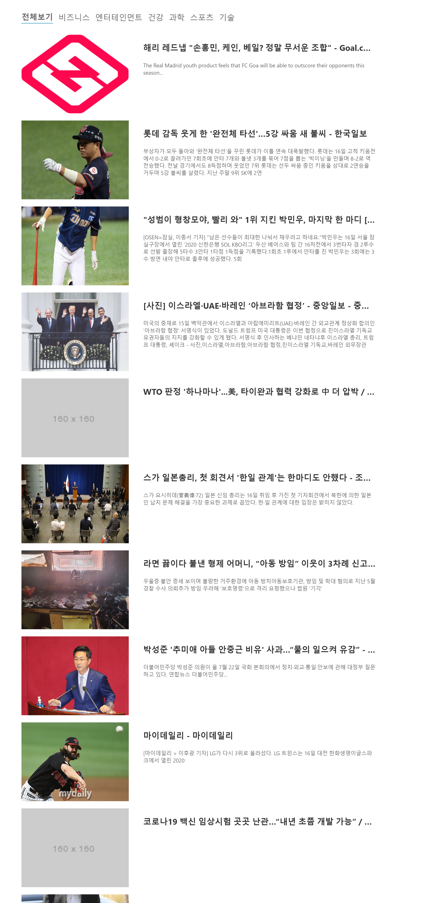

# News Viewer
리액트를 이용한 뉴스 웹 어플리케이션

- 사이트 링크 : [News Viewer](https://github.com/jjjjhjjjj/News-Viewer)

## 사용한 기술
-   
-  

## 프로젝트 화면 및 소개

- 메인 화면  

    - Axois로 API 호출
    - Router를 이용하여 다양한 카테고리 구현
    - _Localhost가 아니면 API 공백 리턴_
